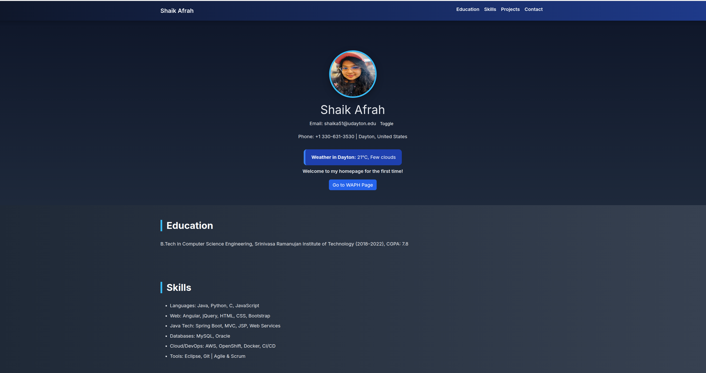
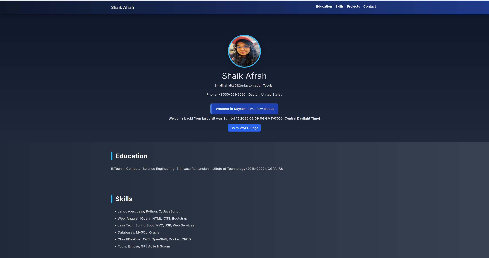
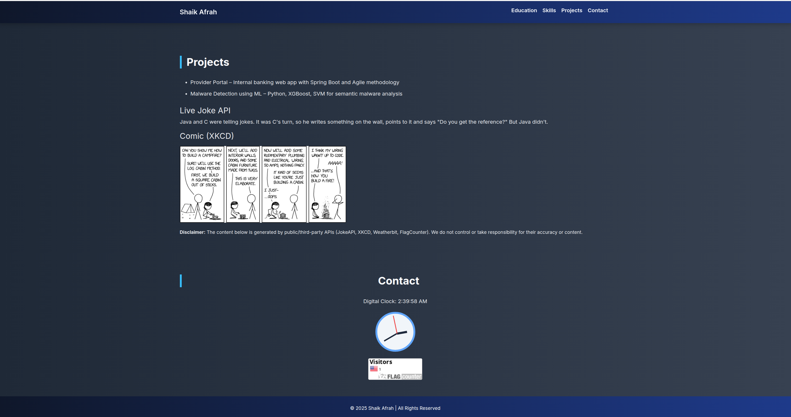
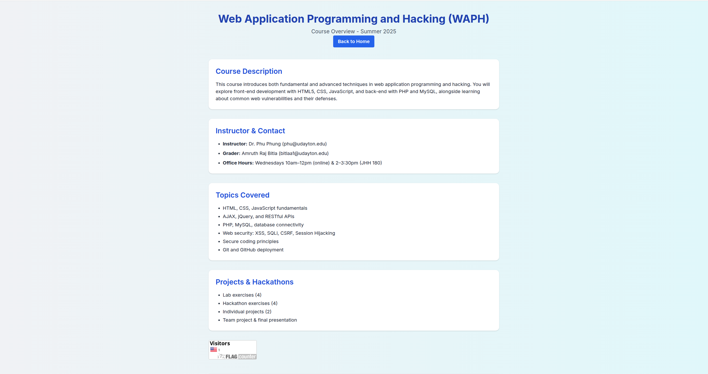

# WAPH-Web Application Programming and Hacking

## Instructor: Dr. Phu Phung

## Student

**Name**: Afrah Shaik

**Email**: [shaika51@udayton.edu](mailto:shaika51@udayton.edu)

---

## Overview

This project involved designing and deploying a professional profile website using front-end web technologies. The goal was to showcase resume content while integrating hands-on JavaScript features and third-party APIs. The website is deployed using GitHub Pages and fulfills both aesthetic and functional criteria including clocks, cookies, email toggles, and external APIs like weather, jokes, and comics.

Through this project, I strengthened my knowledge of JavaScript, HTML/CSS, API integration, and deployment using GitHub. I also practiced secure coding techniques covered in the course.

- [Live Website on GitHub.io](https://shaika51.github.io/  
- [GitHub Repository Link](https://github.com/shaika51/shaika51.github.io)

---

## Project Overview

This project was developed as part of the Web Application Programming and Hacking (WAPH) course taught by Dr. Phu Phung. The objective was to create a professional portfolio website using front-end web technologies and deploy it on GitHub Pages. The website showcases resume content such as education, skills, and projects, and integrates dynamic features and public APIs.

The project helped strengthen practical skills in HTML, CSS, JavaScript, API integration, and cookie-based user tracking. A secondary page (waph.html) introduces the WAPH course and related technical content. The completed website is fully responsive, visually styled using Bootstrap and Tailwind CSS, and meets all the project requirements.

---

## Task Summary

#### General Requirements
- Created and deployed a professional portfolio website using index.html.

- Included personal resume details: name, headshot, email, phone number, education, skills, and experience.

- Added a dedicated waph.html page describing the WAPH course and related topics.

#### Non-Technical Requirements
- Used Bootstrap and Tailwind CSS for responsive and modern design.

- Targeted the website toward potential employers.

- Added a public page tracker using FlagCounter.

#### Technical Requirements
- Implemented the following JavaScript features:

	- Digital clock that updates in real-time.

	- Analog clock showing hours, minutes, and seconds.

	- Toggle button to show/hide email address.

	- Cookie-based visit tracker displaying last visit date and time.

- Integrated two public APIs:

	- JokeAPI – displays a new joke every minute.

	- XKCD Comic API – shows the latest comic.

	- Open-Meteo API – provides live weather updates for Dayton, OH.

- Included a disclaimer about the use of third-party APIs and their content.

---

## Screenshots

  
Figure 1: Main page with profile info

  
Figure 2: Main page with profile info with cookie and live weather

  
Figure 3: XKCD Comic and Joke API visible

  
Figure 4: Separate page detailing course overview